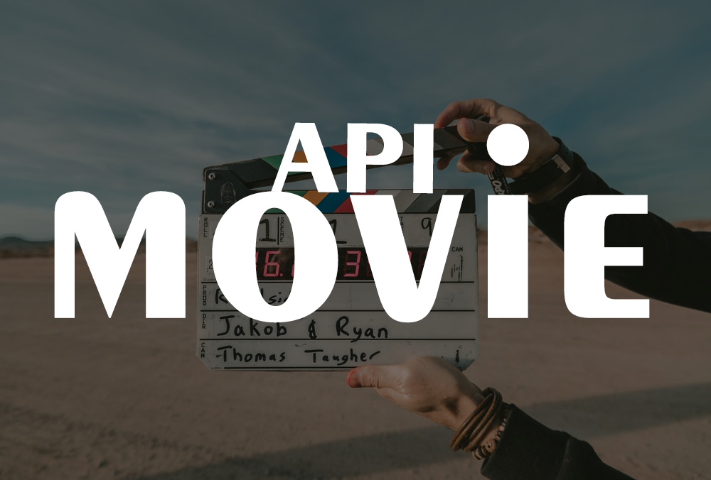
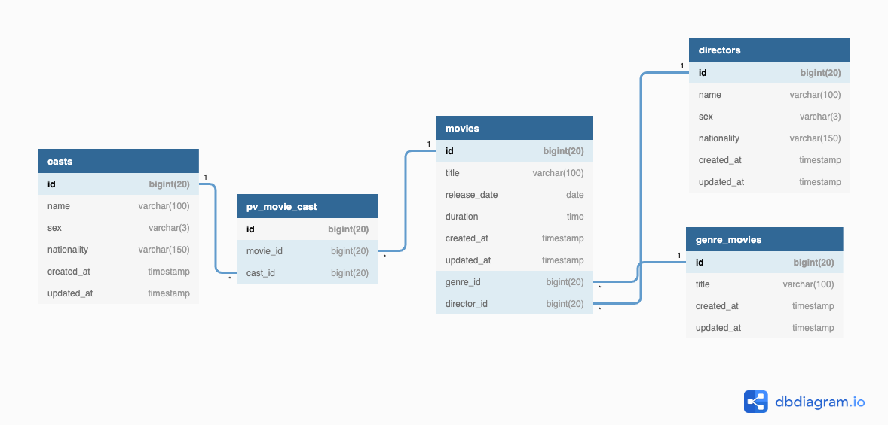

<p align="center">
  
  <a href="https://github.com/glauberborges/ApiMovie/issues" style="text-decoration: none">
    
  </a>
  <a href="#" style="text-decoration: none">
    
  </a>
</p>

<p align="center">
  <a href="#" target="_blank">
    
  </a>
  <a href="https://github.com/solrachix" target="_blank" >
    
  </a>
  <a href="https://github.com/glauberborges" target="_blank" >
    
  </a>
  <a href="mailto:glauber.borges1@gmail.com" target="_blank" >
    
  </a>
  <a href="https://api.whatsapp.com/send?phone=15996121224" target="_blank" >
    
  </a>
</p>

<p align="center">
 <a href="#-projeto">Projeto</a>&nbsp;&nbsp;&nbsp;|&nbsp;&nbsp;&nbsp;
  <a href="#rocket-tecnologias">Tecnologias</a>&nbsp;&nbsp;&nbsp;|&nbsp;&nbsp;&nbsp;
  <a href="#-layout">Layout</a>&nbsp;&nbsp;&nbsp;|&nbsp;&nbsp;&nbsp;
  <a href="#information_source-como-usar">Como usar</a>&nbsp;&nbsp;&nbsp;|&nbsp;&nbsp;&nbsp;
  <a href="#-como-contribuir">Como contribuir</a>&nbsp;&nbsp;&nbsp;|&nbsp;&nbsp;&nbsp;
  <a href="#memo-license">License</a>
</p>

## 💻 Projeto

**ApiMovie** é uma api para cadastro de títulos de filmes.

## 🚀 Banco de Dados



## 🚀 Tecnologias
Para esse projeto foi usado as seguintes tecnologias:

- [Laravel](https://laravel.com)
- [Passport](https://laravel.com/docs/7.x/passport)
- [Mysql](https://github.com/laravel/passport)

## 🛠 Ferramentas
- [PhpStorm](https://www.jetbrains.com/pt-br/phpstorm/)
- [Postman](https://www.postman.com/)

## ⚙️ Instalação

##### Clone o repositório
```bash
  $ git clone https://github.com/glauberborges/ApiMovie.git
```

#### Instale as dependências
```bash
  $ composer install
```


#### Configurando o .env
```bash
  $   Renomeie/Copia o .env.example para .env e configure o banco de dados
  
  DB_CONNECTION=mysql
  DB_HOST=127.0.0.1
  DB_PORT=3306
  DB_DATABASE={DATABASE}
  DB_USERNAME={USER}
  DB_PASSWORD={SENHA}
  
```

#### Migration
```bash
  $ php artisan migrate
```


#### Seed
```bash
  $ php artisan db:seed
```

#### Gerar a key
```bash
  $ php artisan key:generate 
```

#### Passport
```bash
  $ php artisan passport:install
```

#### Servidor
```bash
  $ php artisan serve
```

```bash
  Acesse http://127.0.0.1:8000
```

## 📝 Como usar

Para acessar as rotas da api você ira usar o endereço ``http://127.0.0.1:8000/api``.

Todos os methodos e rotas estão em nossa documentação que pode ser acessada nesse link   [Documentação](https://documenter.getpostman.com/view/1190868/SzzgAKR2?version=latest)

Para teste recomendamos o uso do [Postman](https://www.postman.com/), caso queria importa o json com as rotas pode usar o arquivo [postman_collection](ApiMovie.postman_collection.json) que está na raiz do projeto.

---
